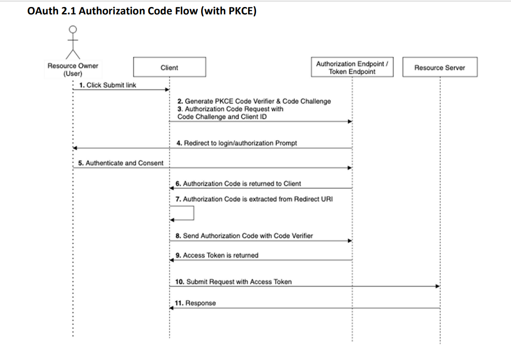
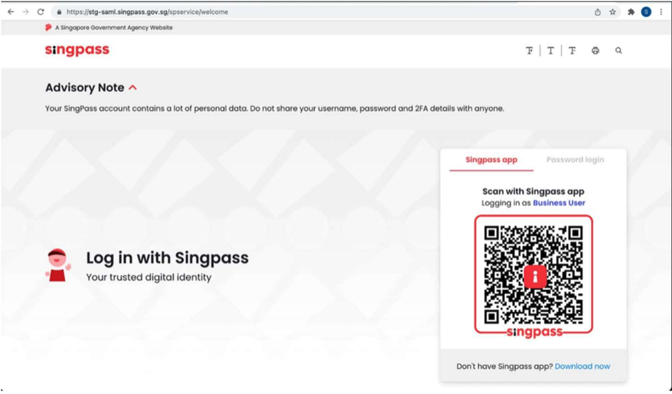
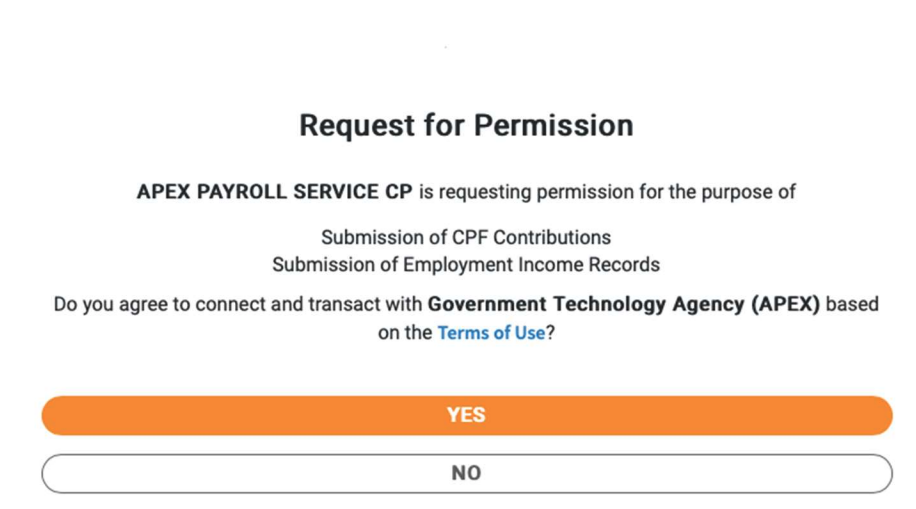

# Authorization Code Flow

This guide explains how to implement the [OAuth](https://datatracker.ietf.org/doc/html/rfc6749) [2.1](https://oauth.net/2.1/) Authorization Code Flow to allow a
CorpPass user to grant a third-party client application access to the Corppass user’s
protected resources.

If you are a Client Application Software Developer (SWD) be sure to carry out onboarding steps first, before carrying out the OAuth flow with the Sandbox endpoints.

The OAuth flow is shown below.



## 1. Authorization Endpoint Request

In your Client Application, you want to provide a button to sign the user in. When the user clicks this button, they are directed to the SingPass Sign-in page so they can authenticate and then authorize themselves. The next 2 steps will help you build the URL for this request.

## 2. Token Endpoint Request

Generate the PKCE Code Verifier and Code Challenge. Learn more about PKCE [here](https://datatracker.ietf.org/doc/html/rfc7636).

- **Code Verifier**: Random URL-safe string with a minimum length of 43 characters
- **Code Challenge**: Base64 URL-encoded SHA-256 hash of the Code Verifier

The generated PKCE code will look like this:

```
code_verifier: owFWUGrbZ3Bk5epaumy2EYkMCQZnkjoL_H79Gv02u0
code_challenge: 3yj50_1LB91nSs9DyzZ5tPZh5H0NxWLwNtYBXOpOrII
```

The Client sends the **code_challenge** in the authorzation request, while the **code_verifier** is sent in the Access Token request later.

A sample code to generate the **code_challenge** and **code_verifier** is [here](docs/consumers/sample-codes?id=generate-code_challenge-and-code_verifier).

## 3. Client Sends Authorization Code Request with the Generated Code Challenge and Client ID

The Client will make a request to the Authorisation Endpoint. The request URL (endpoint links [below](docs/consumers/authz-token?id=table-of-endpoint-urls)) would be like this:

```
{Authorization Endpoint}?client_id={client_id&redirect_uri={redirect_uri}&response_type=code&scope={scope}&code_challenge_method=S256&code_challenge={code_challenge}
```

Parameters are defined as follows:

- **{redirect_uri}** is the Redirect URI of the Client Application (URL encoded)
- **{scope}** is the OAuth2.1 scope which is provided by the Resource Server owner
- **{code_challenge}** is the Code Challenge used for PKCE (generated in Step 2)
- **{client_id}** is the Client ID generated in the onboarding [steps](docs/consumers/onboarding)

Optional Parameter is as follows:

- **{state}** is the Session ID value used by Client Application to maintain state between request and callback.

## 4. Client User is Redirected to the Login and Authorization Pages

The login and consent screens are shown to the user.

_Sample Login Screen_


_Sample Consent Screen_


## 5. The User Authenticates and Authorizes the Client at the Login and Consent Pages.

The User authenticates and authorizes the client in the Login (SingPass) and Consent screens.

## 6. The Authorization Server Redirects User Back to the Client with an Authorization Code

The user is redirected back to the Redirect URI of the Application.<br>
A redirected URL with parameters might look like this:

```
    https://{redirect_uri}/?code=Slq-_k4NUrh5fWLqFz7CwtDpl2ntJbJuvMz1CzBK
```

## 7. Client Extracts Authorization Code from Redirect URI

The client extracts the Authorization Code from the Redirect URI. In the above example, the
code extracted will be:

```
    Slq-_k4NUrh5fWLqFz7CwtDpl2ntJbJuvMz1CzBK
```

## 8. Client sends this Authorization Code to the Token Endpoint, with a Code Verifier

**Exchange the code for Access Token**<br>
To retrieve the Access Token, the Client will pass the Authorization Code to the Token
Endpoint along with the code_verifier (generated in Step 2).
The specifications for the request to the Token Endpoint are as follows:

| Specification  | Information                         |                                                                                                                                          |
| -------------- | ----------------------------------- | ---------------------------------------------------------------------------------------------------------------------------------------- |
| Token Endpoint | **{Token Endpoint}**                |                                                                                                                                          |
| Method         | POST                                |                                                                                                                                          |
| Content-Type   | 'application/x-www-form-urlencoded' |                                                                                                                                          |
| Body           | **key**                             | **Specification**                                                                                                                        |
|                | 'code'                              | String of parameter retrieved from [Step 7 above](docs/consumers/authz-token?id=_7-client-extracts-authorization-code-from-redirect-uri) |
|                | 'client_assertion'                  | **{client assertion}** specified below                                                                                                   |
|                | 'client_id'                         | String of Client ID obtained during onboarding [steps](docs/consumers/onboarding)                                                        |
|                | 'client_assertion_type'             | 'urn:ietf:params:oauth:client-assertion-type:jwt-bearer'                                                                                 |
|                | 'grant_type'                        | Authorization Code obtained in [Step 7 above](docs/consumers/authz-token?id=_7-client-extracts-authorization-code-from-redirect-uri)     |
|                | 'redirect_uri'                      | String of exact redirect URI of Client Application in URL encoded format                                                                 |
|                | 'code_verifier'                     | String of PKCE Code Verifier generated in [Step 2 above](docs/consumers/authz-token?id=_2-token-endpoint-request)                        |

**Client Assertion**<br>

**{client_assertion}** is a JSON formatted list of claims based on RFC7523:

| Claim | Information                                                                                                                                                                                                                 |
| ----- | --------------------------------------------------------------------------------------------------------------------------------------------------------------------------------------------------------------------------- |
| 'iss' | Issuer, also equal to Client ID obtained during onboarding [steps](docs/consumers/onboarding)                                                                                                                               |
| 'sub' | Subject, also equal to Client ID obtained during onboarding [steps](docs/consumers/onboarding)                                                                                                                              |
| 'aud' | Audience, also equal to Authorization Token Endpoint                                                                                                                                                                        |
| 'kid' | Key ID, also equal to the JWT Key ID (public key of the keyset used to sign the client_assertion) in the JWKS Endpoint described above in [Initial Setup](docs/consumers/authz-token?id=pre-requisite-create-jwks-endpoint) |
| 'jti' | JWT ID, an arbitrary value to identify the Access Token request, like a session ID                                                                                                                                          |
| 'iat' | Current epoch time of epoch time, in seconds                                                                                                                                                                                |
| 'exp' | Expiry time in Linux time + 5 minutes, in seconds                                                                                                                                                                           |

A sample code to generate the signed client assertion is [here]().

## 9. The Token Endpoint Returns the Access Token

The response (in a format specified in RFC6749) will contain the Access Token.

```
{
    "access_token":
"eyJ0eXAiOiJKV1QiLCJhbGciOiJSUzI1NiIsImtpZCI6Il9SQzZ4d09NdmJ0dDZhald1WmU2R2xncy1qM3dtNXJpQXlDVW9SYXNhLUkifQ.eyJzdWIiOiIxODAwOTU2MjVaX2FiYjU5OTE4LTZjYWYtNDI4Yi04ZTI1LWVhY2JhZGRiODUyNiIsImp0aSI6IlZPbDMxZ3ZtTWd1S0tydk9JT2RRRGwzNmhrQXRUY09sWjVoSVp0ZkQiLCJzY29wZSI6IkNwZkNvblN1YiBFbXBJbmNvbWVTdWIiLCJleHBpcmVzX2luIjoxODAwLCJhdWQiOiJTVEcyLVRFU1QtQ0xJRU5ULU1BTkdFTUVOVC04dGVzdCIsInJlYWxtIjoiYXBleC1jcCIsImlzcyI6Imh0dHBzOi8vdGVzdC5hcGkubXlpbmZvLmdvdi5zZy9zZXJ2aWNlYXV0aC9hcGV4LWNwIiwiY2xpZW50Ijp7ImNsaWVudF9pZCI6IlNURzItVEVTVC1DTElFTlQtTUFOR0VNRU5ULTh0ZXN0IiwiY2xpZW50X25hbWUiOiJTVEcyLVRFU1QtQ0xJRU5ULU1BTkdFTUVOVC04dGVzdCIsImVudGl0eV91ZW4iOiJUMTZHQjAwMDJHIiwiZW50aXR5X25hbWUiOiJHb3Zlcm5tZW50IFRlY2hub2xvZ3kgQWdlbmN5IChBUEVYKSJ9LCJpYXQiOjE2NTYzNzgzMTMsIm5iZiI6MTY1NjM3ODMxMywiZXhwIjoxNjU2MzgwMTEzfQ.rvySU31cJBgrhd6HfIAdVgy1nEtKbXH64kER_8Lj58v_WAgES0u2KFxSI85L4vkG1vwuRwEGBwKAnQJpLebT0KY0XPiumGfVbPTs-ImIukBSIPDSkqv49mBPr79kVQFjp-YN53VaVbXcWcdt2JxD7OP8w5ocC0ms8W7lFwCwmBW1x8i7HSDwKrtkPJavmqmTca0DfYmJXUcccw68_s520SAZI1dx3WCfOpvQ8ogmEEdVwjZ_sG11cApCVFcUglvvHsk_nSQz_8_SUnE1BFiPa0xmyWxC6xmVZCYUwsV3t2WDallzOuGWBgkUilYU_MUZN_7P9CMO88e071p9ZQ",
    "token_type": "Bearer",
    "expires_in": 299,
    "scope": "CpfConSub EmpIncomeSub"
}
```

## 10. Client Submits Request to the Resource Server with the Access Token

The Client submits request to the Resource Server with the Access Token as a Bearer token
format in the Authorization header of the HTTP request.

```
curl --request GET \
  --url {Resource Server}/{agency}/{api} \
  --header 'authorization: Bearer {ACCESS_TOKEN}' \
  --header 'content-type: application/json' \
  --header 'x-apex-apikey: {API_Key}'

## Do note the previous API_Key header was ApiId
```

## 11. Resource Server Validates the Access Token Before Returning a Response

Once the access token and the scopes have been validated, the resource server processes the
request and returns a response to the client.

## Table of Endpoint URLs

| Sandbox Endpoint       | Access Mechanism                 | Sandbox Link                                                                                                             |
| ---------------------- | -------------------------------- | ------------------------------------------------------------------------------------------------------------------------ |
| Authorization Endpoint | Public TLS                       | Copy link [here](https://sandbox.api.gov.sg/oauth/cp/v2/authorize)                                                       |
| Token Endpoint         | Public TLS with Client Assertion | Copy link [here](https://sandbox.api.gov.sg/oauth/cp/v2/token)                                                           |
| Resource Server        | Public TLS                       | [Browse](https://docs.developer.tech.gov.sg/docs/apex-cloud-user-guide/docs/dev/browse-api) Publisher APIs for the URLs. |

After Sandbox URLs are tested successfully, you may request for Production URL access with the Publisher.

For production URLs, replace **sandbox** with **public** in the domain name.
