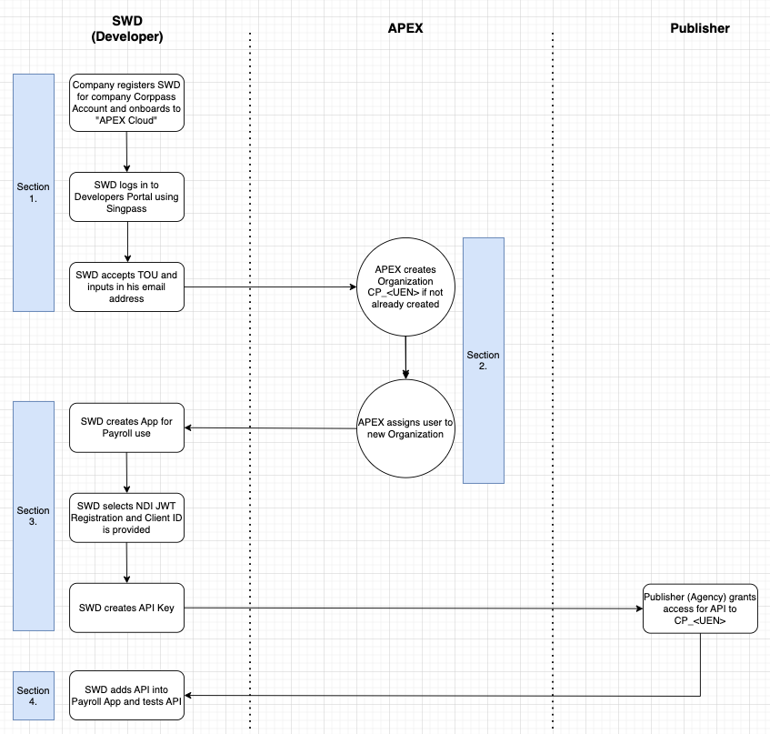

# Onboarding and Setup for Consumers (SWD)

These are the steps for onboarding and setup for application development using Apex Cloud. Nomenclature for this document can be found [here](docs/consumers/nomenclature.md).

The swim-lane is shown below.

Generally it consists of 4 sections: **_Corppass Setup_**, **_APEX Setup_**, **_Application Setup_** and **_Business API Test_**. The onboarding Steps are as below:

## 1. Corpaass Setup

The software developer (SWD) will often need to simulate the payroll process and role-play the company submitter.

The Company which is registered with Corpass (which SWD is in) will need to register the User (SWD) to the Corpass Digital Service (e-service ID) - **"Apex Cloud"**. Read [here](https://docs.developer.tech.gov.sg/docs/apex-cloud-onboarding/docs/corppass).

The User (SWD) then logs into the Developers Portal (www.api.developer.tech.gov.sg) using Singpass. Refer to [Step 1 here](https://docs.developer.tech.gov.sg/docs/apex-cloud-onboarding/docs/consumers?id=corppass-users).

## 2. APEX Setup

APEX will automatically create the consumer Organization (**CP\_\<UEN\>**) for the company which the User (SWD) is registered to and add the user into this Organization.

Do double-check that you are onboarded to this Organization. Refer to [Step 2 here](https://docs.developer.tech.gov.sg/docs/apex-cloud-onboarding/docs/consumers?id=corppass-users).

## 3. Application Setup

The SWD can browse APIs [here](https://docs.developer.tech.gov.sg/docs/apex-cloud-user-guide/docs/dev/browse-api).

The SWD will then create the Application in the Developers Portal (Read [here](https://docs.developer.tech.gov.sg/docs/apex-cloud-user-guide/docs/dev/applications?id=step-2-creating-the-application)), and request access to the API (Read [here](https://docs.developer.tech.gov.sg/docs/apex-cloud-user-guide/docs/dev/consume-api?id=consume-apis)). The Publisher may at this point have to approve your API request.

The SWD will also have to [create and host a JWKS endpoint](docs/consumers/create-jwks-endpoint.md) and then onboard to Oauth 2.1 for Sandbox (Read [here](https://docs.developer.tech.gov.sg/docs/apex-cloud-user-guide/docs/dev/oauth)) and get the Client ID (or App ID) for the Business API call.

The SWD will also ensure that the API Key for the business API is created. Read [here](https://docs.developer.tech.gov.sg/docs/apex-cloud-user-guide/docs/dev/applications?id=step-4-creating-api-keys-for-your-approved-application).

## 4. Business API Test

The Publisher API Specs can usually be found [here](https://docs.developer.tech.gov.sg/docs/apex-cloud-user-guide/docs/dev/browse-api) (or if not, contact the Publisher directly).

The Authorization Code Flow is detailed [here](docs/consumers/authz-token).

The Business API request through APEX requires these additional headers below.

| S/No | Terms         | Meaning                                                   |
| ---- | ------------- | --------------------------------------------------------- |
| 1    | Authorization | Authorization Token obtained from Authorization Code flow |
| 2    | x-apex-apikey | API Key obtained from Step 3 above                        |
